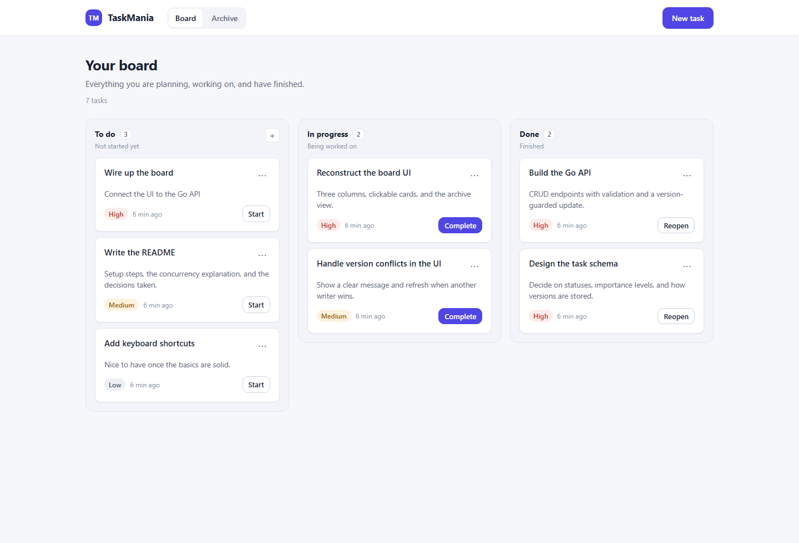

# TaskMania

A task board. Move work through **To do**, **In progress**, and **Done**, set importance, archive what you do not need.



## Run

Go 1.27+ and Node 24+. SQLite is used by default, so there is no database to install.

```bash
cd api && go run ./cmd/server                 # :8080
cd taskmania && npm install && npm run dev    # :5173
```

Open http://localhost:5173.

```bash
make test
# or
cd api && go test ./...
cd taskmania && npm test
```

`docker compose up --build` runs the full stack on http://localhost:3000.

## Concurrent edits

Each task has a `version`. Updates must send it, and the database enforces it:

```sql
UPDATE tasks SET ..., version = version + 1
WHERE id = ? AND version = ?
```

If someone else saved first, the second writer gets **409**. The UI explains that and reloads. A missing `version` is **422**.

## API

| Method | Path | |
| --- | --- | --- |
| `GET` | `/health` `/ready` | process / database |
| `GET` | `/tasks` | `archived`, `status`, `importance`, `page`, `limit` |
| `POST` | `/tasks` | `title` required |
| `GET` `PUT` `DELETE` | `/tasks/{id}` | `PUT` needs `version` |

Errors look like `{ "error": { "code", "message", "fields?" } }`.
